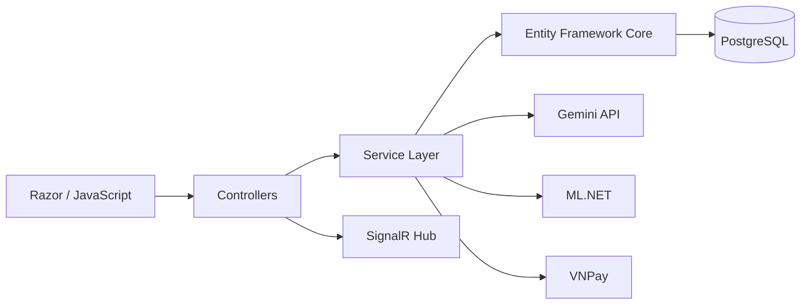

# Coffee Shop Deployment & Demo Plan for Codex

> Project: `Ecommerce-Coffee-Shop`
> Goal: turn the current student project into a recruiter-ready public demo with secure configuration, reproducible local setup, cloud deployment, CI/CD, demo data, testing, and portfolio documentation.

---

## 1. Mission

Codex should improve the project in a controlled, verifiable sequence:

1. Remove exposed secrets from tracked source files.
2. Make the project reproducibly runnable from a fresh clone.
3. Upgrade the application from .NET 6 to a supported LTS target, preferably .NET 10.
4. Prepare production-safe configuration.
5. Prepare Azure App Service deployment.
6. Configure GitHub Actions CI/CD.
7. Prepare a safe demo database and demo accounts.
8. Verify main flows, AI features, SignalR, payment sandbox, and Playwright tests.
9. Improve README for recruiters.
10. Produce a short demo runbook and a list of verified CV claims.

---

# 2. Non-Negotiable Rules

## 2.1 Security

- NEVER print or expose secrets in terminal output, Markdown, logs, screenshots, commits, or generated files.
- NEVER commit:
  - database passwords;
  - API keys;
  - VNPay secrets;
  - access tokens;
  - connection strings containing credentials;
  - Azure publish profiles;
  - private certificates.
- If a secret is discovered in Git history or tracked files:
  1. report only the **file path and configuration key name**;
  2. do not reproduce the secret value;
  3. replace the tracked value with an empty value or safe placeholder;
  4. tell the user which credential must be manually rotated.
- Do not automatically revoke or rotate external credentials unless a supported authenticated tool explicitly exists and the user has authorized it.
- Do not delete production data.
- Do not alter an existing Supabase database destructively without explicit confirmation.

## 2.2 Git Safety

Create branches before major work:

```bash
git checkout -b chore/security-hardening
```

For framework migration:

```bash
git checkout -b upgrade/dotnet10
```

For deployment:

```bash
git checkout -b chore/azure-deployment
```

Do not force-push `main`.

Do not rewrite Git history without explicit user approval.

## 2.3 Accuracy

Only add technologies to README/CV after they are actually implemented and verified.

Do **not** claim:

- Docker
- xUnit
- Moq
- Azure
- GitHub Actions
- Integration Testing
- CI/CD
- .NET 10

until they have passed the corresponding acceptance criteria below.

---

# 3. Definition of Done

The project is considered recruiter-ready only when all applicable checks below pass:

```text
Fresh clone restores successfully                     [ ]
Application builds with zero errors                   [ ]
Application starts locally                            [ ]
Database migration/setup succeeds                     [ ]
Register/Login works                                  [ ]
Customer product browsing works                       [ ]
Cart works                                            [ ]
Checkout works                                        [ ]
COD order creation works                              [ ]
VNPay sandbox flow is configured safely               [ ]
Admin login works                                     [ ]
Staff login works                                     [ ]
SignalR order update works                            [ ]
Gemini feature works                                  [ ]
ML.NET recommendation/forecast feature works          [ ]
Playwright E2E suite runs successfully                [ ]
No secrets remain in tracked current files            [ ]
Production configuration uses environment variables   [ ]
Public Azure URL loads successfully                   [ ]
Production database is separate from development      [ ]
GitHub Actions build succeeds                         [ ]
GitHub Actions deployment succeeds                    [ ]
README contains Live Demo                             [ ]
README contains architecture and setup instructions   [ ]
Demo account/data is safe for public use              [ ]
5-minute interview demo can be completed reliably     [ ]
```

---

# 4. Phase 0 — Repository Audit

## Goal

Understand the existing repository before changing code.

## Codex Tasks

Inspect:

```text
*.sln
*.csproj
Program.cs
Startup.cs (if present)
appsettings*.json
Properties/launchSettings.json
Controllers/
Areas/
Services/
Data/
Models/
Hubs/
Middleware/
Migrations/
tests/
package.json
playwright.config.*
.github/
README.md
.gitignore
```

Report:

1. Current .NET target framework.
2. NuGet package versions.
3. Database provider.
4. Authentication mechanism.
5. SignalR setup.
6. Gemini integration location.
7. ML.NET integration location.
8. VNPay integration location.
9. Playwright setup.
10. Existing deployment-related files.
11. Potential secrets by **key/path only**.
12. Current build status.

Run:

```bash
dotnet --info
dotnet restore
dotnet build
```

If Node/Playwright exists:

```bash
npm install
npx playwright --version
```

## Output

Create:

```text
docs/DEPLOYMENT_AUDIT.md
```

Include:

- current architecture;
- risks;
- blockers;
- recommended next step.

## Acceptance Criteria

```text
Repository audited                     [ ]
Current build status documented        [ ]
Secret locations documented safely     [ ]
External dependencies identified       [ ]
```

---

# 5. Phase 1 — Security Hardening

## Goal

Ensure no current tracked configuration file contains live credentials.

## Codex Tasks

Search carefully for likely secret keys:

```text
ApiKey
Password
ConnectionString
HashSecret
TmnCode
Token
Secret
Bearer
ClientSecret
PrivateKey
```

Do not display values.

### Replace tracked secrets

Convert configuration such as:

```json
{
  "Gemini": {
    "ApiKey": "REAL_VALUE"
  }
}
```

to:

```json
{
  "Gemini": {
    "ApiKey": ""
  }
}
```

or safe placeholders.

Ensure local-only configuration is ignored where appropriate.

Review/update `.gitignore` for:

```text
appsettings.Local.json
appsettings.Secrets.json
.env
.env.*
*.user
*.publishsettings
secrets.json
```

Do not ignore files that the application actually requires as templates.

### Add safe configuration documentation

Create:

```text
docs/CONFIGURATION.md
```

Document required keys only:

```text
ConnectionStrings__DefaultConnection
Gemini__ApiKey
VNPAY__TmnCode
VNPAY__HashSecret
VNPAY__BaseUrl
VNPAY__ReturnUrl
VNPAY__IpnUrl
```

If other real keys exist, include their names as well.

### USER ACTION REQUIRED

Codex must stop and clearly ask the user to manually rotate any credential that was previously committed:

```text
[USER ACTION] Rotate Supabase/PostgreSQL password
[USER ACTION] Revoke and create a new Gemini API key
[USER ACTION] Replace VNPay sandbox credentials if exposed
```

Do not proceed to public deployment until the user confirms rotation.

## Acceptance Criteria

```text
No live secret in current tracked config files   [ ]
.gitignore reviewed                              [ ]
Configuration guide created                     [ ]
User informed which secrets require rotation    [ ]
User confirms credentials were rotated          [ ]
```

---

# 6. Phase 2 — Fresh-Clone Local Reproducibility

## Goal

A recruiter/developer should be able to clone the project and run it with documented configuration.

## Codex Tasks

Test from a clean clone or clean working directory.

Expected flow:

```bash
git clone <repo-url>
cd Ecommerce-Coffee-Shop

dotnet restore
dotnet build
```

If EF CLI is required:

```bash
dotnet tool restore
```

or document:

```bash
dotnet tool install --global dotnet-ef
```

Database setup:

```bash
dotnet ef database update
```

Run:

```bash
dotnet run
```

Verify local application manually or through available tests.

### Main local flows

#### Customer

```text
Register
→ Login
→ Browse products
→ AI recommendation
→ Add to cart
→ Checkout
→ COD
→ Order created
```

#### Staff

```text
Login
→ View order
→ Update order status
```

#### SignalR

```text
Customer browser
→ Staff changes status
→ Customer receives real-time update
```

#### Admin

```text
Login
→ Products
→ Orders
→ Users
→ Dashboard
→ Revenue
→ Forecast / AI Insights
```

### Playwright

If configured:

```bash
npm install
npx playwright install
npx playwright test
```

Fix only reproducible failures.

## Output

Update README:

```text
Prerequisites
Configuration
Database Setup
Run Locally
Testing
```

## Acceptance Criteria

```text
Fresh restore passes      [ ]
Fresh build passes        [ ]
Database setup passes     [ ]
Local run passes          [ ]
Core customer flow works  [ ]
Admin flow works          [ ]
Staff flow works          [ ]
SignalR works locally     [ ]
Playwright passes         [ ]
```

---

# 7. Phase 3 — Upgrade .NET 6 to .NET 10 LTS

## Goal

Move away from unsupported .NET 6 before portfolio deployment.

## Branch

```bash
git checkout -b upgrade/dotnet10
```

## Codex Tasks

Inspect the project target:

```xml
<TargetFramework>net6.0</TargetFramework>
```

Change to:

```xml
<TargetFramework>net10.0</TargetFramework>
```

Then:

```bash
dotnet restore
dotnet build
```

Update incompatible NuGet packages one group at a time.

Priority order:

```text
1. ASP.NET Core packages
2. Entity Framework Core
3. Authentication packages
4. PostgreSQL/Npgsql
5. ML.NET
6. SignalR-related packages
7. Other third-party dependencies
```

After each group:

```bash
dotnet build
```

Then run:

```bash
dotnet ef database update
dotnet run
```

Finally:

```bash
npx playwright test
```

## Stop Condition

If migration requires a major architectural rewrite or causes unresolved critical incompatibilities:

1. document the blockers;
2. do not fake completion;
3. stop and ask the user before proceeding.

## Output

Create:

```text
docs/DOTNET10_MIGRATION.md
```

Include:

- packages changed;
- code changes;
- migration issues;
- final verification results.

## Acceptance Criteria

```text
TargetFramework = net10.0    [ ]
dotnet restore passes        [ ]
dotnet build passes          [ ]
Application runs             [ ]
EF migrations work           [ ]
Core flows work              [ ]
Playwright passes            [ ]
```

Only after all are checked may README/CV mention `.NET 10`.

---

# 8. Phase 4 — Production-Safe Configuration

## Goal

Prepare the app to run on Azure using environment variables.

## Codex Tasks

Verify ASP.NET Core configuration supports environment overrides.

Expected production keys:

```text
ConnectionStrings__DefaultConnection
Gemini__ApiKey

VNPAY__TmnCode
VNPAY__HashSecret
VNPAY__BaseUrl
VNPAY__ReturnUrl
VNPAY__IpnUrl
```

Add any other required settings discovered during audit.

Do not hardcode production URLs where avoidable.

If needed, support:

```text
ASPNETCORE_ENVIRONMENT=Production
```

Ensure errors shown to public users do not reveal stack traces or secrets.

Verify:

- production exception handling;
- HTTPS redirect;
- forwarded headers if required;
- WebSocket compatibility for SignalR;
- secure cookie settings appropriate to hosted HTTPS.

## Output

Create:

```text
docs/PRODUCTION_CONFIGURATION.md
```

## Acceptance Criteria

```text
App starts with env vars only         [ ]
No production secret in repository    [ ]
Production error handling enabled     [ ]
SignalR production config reviewed    [ ]
VNPay callback URLs configurable      [ ]
```

---

# 9. Phase 5 — Demo Database

## Goal

Use a separate demo database instead of development data.

## USER ACTION

Create a new Supabase/PostgreSQL database/project for demo deployment.

Suggested name:

```text
coffee-shop-demo
```

Do not reuse the development database if avoidable.

## Codex Tasks

Prepare migration commands:

```bash
dotnet ef database update
```

Prepare safe seed/demo data.

Recommended demo dataset:

```text
10–20 products
3 categories minimum
1 public customer demo account
1 staff account
1 admin account
sample historical orders
enough data for dashboard
enough data for recommendation/forecast where required
```

### Public Credentials Rule

A public demo customer may be documented.

Do NOT publish an admin password in README.

Do NOT publish sensitive customer data.

## Acceptance Criteria

```text
Separate demo DB exists          [ ]
Migrations applied               [ ]
Seed/demo data created safely    [ ]
Dashboard has useful data        [ ]
AI/forecast has enough data      [ ]
```

---

# 10. Phase 6 — Azure App Service Deployment

## Goal

Expose the application through a stable public HTTPS URL.

## USER ACTION

The user may need to perform Azure Portal/account steps.

Recommended resource:

```text
Azure App Service
Runtime: .NET 10
OS: Linux
HTTPS enabled
```

Suggested app name:

```text
khaicoffee-demo
```

Expected URL pattern:

```text
https://<app-name>.azurewebsites.net
```

## Codex Tasks

Prepare the application for App Service deployment.

Verify:

```bash
dotnet publish -c Release
```

Build output must succeed.

Document required Azure App Service environment variables.

For SignalR, document requirement to enable WebSockets if needed.

For VNPay sandbox, production demo callbacks should use the public Azure URL, for example:

```text
https://<app-name>.azurewebsites.net/<actual-return-route>
https://<app-name>.azurewebsites.net/<actual-ipn-route>
```

Use actual project routes discovered from source code. Do not invent routes.

## Output

Create:

```text
docs/AZURE_DEPLOYMENT.md
```

Include:

1. resource creation;
2. runtime;
3. application settings;
4. WebSockets;
5. database connection;
6. deployment procedure;
7. troubleshooting.

## Acceptance Criteria

```text
Release publish succeeds         [ ]
Azure app starts                 [ ]
Homepage loads over HTTPS        [ ]
Database connection works        [ ]
Register/Login works             [ ]
Gemini works                     [ ]
SignalR works                    [ ]
COD works                        [ ]
VNPay sandbox callback works     [ ]
Admin dashboard works            [ ]
```

Only then may README/CV mention Azure deployment.

---

# 11. Phase 7 — GitHub Actions CI/CD

## Goal

Automatically build and deploy successful changes from the main branch.

## Codex Tasks

Create:

```text
.github/workflows/azure-deploy.yml
```

Minimum pipeline:

```text
Checkout
→ Setup .NET
→ Restore
→ Build
→ Test
→ Publish
→ Deploy Azure App Service
```

Do not put Azure credentials directly in YAML.

Use GitHub Secrets or recommended Azure authentication.

Possible secret names:

```text
AZURE_WEBAPP_NAME
AZURE_WEBAPP_PUBLISH_PROFILE
```

Prefer a more secure Azure identity method if practical.

### Optional Node/Playwright Step

Do not add Playwright to deployment CI until baseline CI/CD is stable.

After stable deployment:

```text
npm ci
npx playwright install --with-deps
npx playwright test
```

Only add if it reliably passes in CI.

## Acceptance Criteria

```text
Push triggers workflow            [ ]
Restore passes                    [ ]
Build passes                      [ ]
Tests pass                        [ ]
Deployment succeeds               [ ]
Public app stays healthy          [ ]
No secrets stored in workflow     [ ]
```

Only then may CV mention:

```text
GitHub Actions
CI/CD
```

---

# 12. Phase 8 — Optional Backend Unit & Integration Tests

## Goal

Close the main gap for Software Development / Backend internship applications.

Do not add fake testing claims.

## Recommended Tools

```text
xUnit
Moq
ASP.NET Core integration testing
```

## Priority Test Targets

Start with business logic:

```text
OrderService
CartService
Payment/VNPay service
Recommendation service
Forecast service
Authentication/authorization helper logic
```

Example categories:

```text
Cart total calculation
Invalid quantity handling
Order creation
Order status transition
Payment callback validation
Service error handling
```

Then integration tests:

```text
Application starts
Database access test
Authentication endpoint/flow
Order endpoint/flow
```

## Acceptance Criteria

```text
Unit test project created         [ ]
Core service tests pass           [ ]
Integration tests added           [ ]
Tests run via dotnet test         [ ]
Tests run in GitHub Actions       [ ]
```

Only then may CV list:

```text
xUnit
Moq
Unit Testing
Integration Testing
```

---

# 13. Phase 9 — Recruiter-Friendly README

## Goal

A recruiter should understand the project in under two minutes.

## Required README Order

```text
1. Project title
2. Live Demo
3. GitHub/source
4. 1-paragraph overview
5. Screenshots
6. Key Features
7. AI/ML Features
8. Architecture
9. Tech Stack
10. Database
11. Testing
12. Deployment
13. Local Setup
14. Demo account
```

Top section example:

```md
# Coffee Shop E-Commerce

Live Demo: https://<app-name>.azurewebsites.net

A full-stack e-commerce application built with ASP.NET Core,
PostgreSQL, SignalR, VNPay, Gemini AI, and ML.NET.
```

### Architecture Diagram

Use Mermaid if GitHub renders it correctly:



### Demo Account

Only publish safe customer credentials.

Example structure:

```md
## Demo Account

Customer:
- Email: demo@example.com
- Password: <demo-password>
```

Do not publish administrator credentials.

## Acceptance Criteria

```text
Live demo visible near top        [ ]
Screenshots included              [ ]
Features concise                  [ ]
Architecture documented          [ ]
Testing documented               [ ]
Deployment documented            [ ]
Local setup verified             [ ]
No secrets exposed               [ ]
```

---

# 14. Phase 10 — 5-Minute Interview Demo

Create:

```text
docs/DEMO_SCRIPT.md
```

## Script

### 0:00–0:30 — Intro

Explain:

```text
ASP.NET Core
PostgreSQL
3 roles
AI features
Realtime order tracking
Cloud deployment
```

### 0:30–1:10 — Customer Flow

```text
Login
→ Browse menu
→ Product detail
```

### 1:10–2:00 — AI Feature

Show drink recommendation.

Explain:

```text
User context
→ Backend service
→ Gemini API
→ Recommendation result
```

### 2:00–2:40 — Checkout

```text
Add to Cart
→ Checkout
→ COD or VNPay Sandbox
→ Order Created
```

### 2:40–3:30 — SignalR

Use two sessions:

```text
Customer browser
Staff browser
```

Change status from staff and show customer update in real time.

### 3:30–4:20 — Admin

Show:

```text
Revenue
Top products
Forecast
AI Business Insights
```

### 4:20–5:00 — Engineering

Show GitHub structure:

```text
Controllers
Areas
Services
Data
Middleware
Hubs
Tests
GitHub Actions
```

Explain architecture and deployment briefly.

---

# 15. Final CV Claims

Codex should create:

```text
docs/VERIFIED_CV_CLAIMS.md
```

It must contain only verified claims.

Example after successful deployment:

```text
- Deployed ASP.NET Core application to Azure App Service.
- Configured PostgreSQL/Supabase using production environment variables.
- Implemented GitHub Actions CI/CD for automated build and deployment.
- Integrated Gemini API for AI-powered recommendations.
- Implemented SignalR real-time order updates.
- Implemented Playwright end-to-end testing.
```

If unit tests are completed:

```text
- Implemented xUnit/Moq tests for core backend business logic.
```

If something failed or was not completed, do not list it.

---

# 16. Recommended Commit Plan

Use small commits.

```text
chore: remove secrets from tracked configuration
docs: add secure configuration guide
fix: make fresh-clone local setup reproducible
chore: migrate application to .NET 10
fix: update packages for .NET 10 compatibility
chore: prepare production environment configuration
docs: add Azure deployment guide
test: stabilize Playwright e2e suite
ci: add Azure build and deploy workflow
docs: add live demo and architecture to readme
docs: add interview demo script
```

Avoid one huge commit.

---

# 17. Codex Execution Protocol

For every phase:

1. Inspect before editing.
2. State the files that will be changed.
3. Make the smallest necessary change.
4. Run validation commands.
5. Report:
   - changed files;
   - commands executed;
   - tests/build result;
   - unresolved issues;
   - manual user actions required.
6. Commit only after validation passes.
7. Do not automatically proceed past a phase containing `[USER ACTION]`.

Use this reporting template:

```md
## Phase X Result

### Changed
- file 1
- file 2

### Validation
- `dotnet build` — PASS/FAIL
- `dotnet test` — PASS/FAIL
- `npx playwright test` — PASS/FAIL

### Manual Action Required
- ...

### Blockers
- ...

### Ready for Next Phase
YES / NO
```

---

# 18. First Codex Prompt

After placing this file in the repository root, start Codex with:

```text
Read COFFEE_SHOP_DEPLOYMENT_PLAN.md completely.

Start with Phase 0 only.

Do not modify application behavior yet.
Do not expose any secret values.
Audit the repository, run the safe validation commands defined in Phase 0,
and create docs/DEPLOYMENT_AUDIT.md.

When Phase 0 is finished, stop and report the result.
Do not start Phase 1 until I approve it.
```

After reviewing Phase 0, continue with:

```text
Continue with Phase 1 from COFFEE_SHOP_DEPLOYMENT_PLAN.md.

Follow all security and Git safety rules.
Never print secret values.
Stop at every USER ACTION item and wait for my confirmation.
```

---

# 19. Final Target

The final recruiter experience should be:

```text
Recruiter opens CV
        ↓
Clicks GitHub
        ↓
Coffee Shop is pinned first
        ↓
README shows Live Demo
        ↓
Clicks public HTTPS URL
        ↓
Tests real application
        ↓
Sees AI recommendation
        ↓
Creates order
        ↓
Sees real-time update
        ↓
Reviews architecture/testing/deployment
```

The goal is not merely to make the app "run somewhere".

The goal is to demonstrate:

```text
I designed it.
I built it.
I tested it.
I secured it.
I deployed it.
I automated deployment.
I can explain how it works.
```
