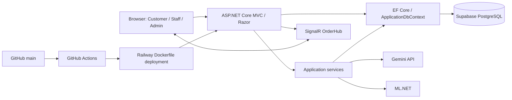

# Coffee Shop E-Commerce Platform


[](https://github.com/Nolove098/Ecommerce-Coffee-Shop/actions/workflows/ci.yml)

A production-deployed ASP.NET Core coffee-shop e-commerce and management system connecting online ordering with Staff POS and Admin operations. It combines PostgreSQL persistence, realtime order updates, AI-assisted menu discovery, automated testing, and CI/CD in one web application.

## Live Demo

**[Open the live application](https://coffeeshop-demo-production.up.railway.app)** · [Source code](https://github.com/Nolove098/Ecommerce-Coffee-Shop)

Hosted on **Railway**, with **Supabase PostgreSQL**. Browse the menu or register your own customer account to try the shopping flow. The application UI is primarily Vietnamese. VNPay is a sandbox integration; use COD for the demonstrated checkout flow. Admin and Staff credentials are not published.

[Features](#key-features) · [Architecture](#architecture) · [Testing](#testing) · [Local setup](#local-setup)

## Key Features

| Workflow | Implemented functionality |
|---|---|
| Customer | Registration/login, menu and category browsing, persistent cart, COD checkout, order history, product reviews |
| Staff | POS order creation, customer/table assignment, invoice display |
| Admin | Product and category-field editing, order status management, user and Staff management, revenue dashboard and statistics |
| Realtime | Private customer order updates and an Admin dashboard group through SignalR |
| AI / ML | Drink recommendations, natural-language menu search, business insights, purchase-history recommendations, revenue forecasting |

## My Contributions

**Primary role: Full-Stack / Backend & AI Developer.** My focus within this collaborative project includes:

- Developing MVC customer, Staff, and Admin workflows, cookie authentication, and role authorization.
- Extending EF Core data access, cart/order persistence, and database configuration.
- Integrating SignalR order notifications and server-side Gemini and ML.NET services.
- Hardening production configuration and Supabase connection normalization, and deploying the application on Railway.
- Adding GitHub Actions build/deployment gates, deterministic backend tests, and critical browser validation.

The repository has multiple contributors, including database and VNPay integration work. This section describes my focus, not sole authorship of every component; the commit history preserves attribution.

## Tech Stack

| Area | Verified implementation |
|---|---|
| Backend | .NET 10, ASP.NET Core MVC, Razor Pages, dependency injection |
| Persistence | EF Core Relational/Design 10.0.11, Npgsql EF provider 10.0.0, PostgreSQL hosted on Supabase |
| Frontend | Razor, HTML, CSS, JavaScript, Bootstrap; selected Blazor Server components |
| Realtime | ASP.NET Core SignalR |
| AI / ML | Google Gemini API integration, ML.NET 3.0.1, Recommender 0.21.1, TimeSeries 3.0.1 |
| Tests | xUnit 2.9.3, Coverlet collector 6.0.4, Playwright (lockfile: 1.58.2) |
| Delivery | GitHub Actions, Railway, multi-stage .NET Dockerfile |

Package versions are defined in [SaleStore.csproj](SaleStore.csproj), [the test project](SaleStore.Tests/SaleStore.Tests.csproj), and [package-lock.json](package-lock.json).

## Architecture



## Backend Architecture

Controllers handle HTTP requests, authorization, and view/API responses. Dependency-injected services encapsulate AI, recommendation, forecasting, password hashing, and payment integration. Services and several controllers access `ApplicationDbContext` directly: this is an MVC application with a service layer, not a strict separation of all persistence behind services.

`Program.cs` configures dependency injection, authentication, session state, and routing. Custom request-logging middleware records requests. Form ViewModels use validation attributes, including `StrongPasswordAttribute`; controllers check model validity where applicable. Admin and Staff functionality lives in MVC Areas.

## Database

PostgreSQL is hosted on Supabase and accessed server-side through Npgsql using the **Session Pooler**. `ApplicationDbContext` maps `AppUsers`, `Customers`, `Products`, `Orders`, `OrderItems`, `Reviews`, `UserCartItems`, and `AuthActivities`. Category is a product field, rather than a separate entity.

EF Core migrations are versioned under [Migrations](Migrations). Relationships, unique indexes, and the computed order-item total are configured in the context. Production schema changes are manually controlled: neither application startup nor CI/CD automatically applies migrations.

## Roles & Authorization

| Role | Access |
|---|---|
| Customer (stored as `User`) | Shopping, personal cart and order history |
| Staff | POS; also accessible to Admin |
| Admin | Protected management pages, order status updates, analytics and AI insights |

Cookie authentication revalidates the user's active state and role against the database. `OrderHub` requires authentication; a customer may join only their own order group, while Staff/Admin may join order groups. The dashboard group requires Admin.

## AI & ML Features

### Gemini Integration

The backend sends drink preferences or a natural-language query with current menu data to the API. Returned product IDs are matched to active products before response enrichment. A separate chatbot supports menu-related conversation. The API key stays in server configuration; missing configuration, HTTP errors, and malformed responses have fallback/error paths.

### Personalized Recommendation

`ProductRecommendService` uses ML.NET matrix factorization over purchase history. Best-seller recommendations provide a fallback when personalization or training is unavailable. A personalized result depends on usable customer history and model availability.

### Sales Forecast

`SalesForecastService` builds daily revenue history from delivered orders and uses ML.NET SSA forecasting. A managed forecast fallback handles unavailable native SSA dependencies. The feature does not establish measured prediction accuracy.

### AI Business Insights

The Admin insights endpoint summarizes recent orders, revenue, and top products for AI-generated analysis. It is protected by Admin authorization.

| Method | Endpoint | Purpose |
|---|---|---|
| POST | `/api/Ai/recommend` | Drink suggestions |
| POST | `/api/Ai/search` | Natural-language menu search |
| GET | `/api/Ai/recommend/ml` | History-based or fallback recommendations |
| GET | `/api/Ai/admin/forecast?days=7` | Admin revenue forecast |
| GET | `/api/Ai/admin/insights` | Admin business insights |

## Realtime Order Updates

An Admin changes an order status → the backend saves it → SignalR publishes to the private `order-{id}` group → the authorized customer's order page updates without a reload. The hub is mapped at `/hubs/order`; group authorization is enforced on the server.

## Testing

The validated Phase 8 backend baseline is **74 passed, 0 failed, 0 skipped**, with **three successful consecutive runs**. The xUnit suite covers password hashing, PostgreSQL parsing, Supabase normalization, password validation, order-status display behavior, chatbot input handling, and Gemini behavior with fake HTTP responses. It does not call the production database or live AI service.

Focused deterministic backend coverage was prioritized over artificial coverage-percentage optimization. Informational Coverlet coverage across the instrumented application assembly is **3.44% lines** and **4.87% branches**; this is not browser coverage or a claim of broad business-workflow coverage.

### Critical Playwright Suite

The verified production baseline is **5 passed, 0 failed, 0 skipped**. The five tests cover:

1. Public pages and protected-route behavior.
2. Customer registration, login, cart, COD checkout, and order history.
3. A live Gemini response.
4. Authenticated Admin/Staff pages and selected AI endpoints.
5. A private customer SignalR update without page reload.

These are critical demo checks, not exhaustive application coverage. See [testing details](docs/TESTING.md) and [the test definitions](tests/critical-demo.spec.js).

## CI/CD

**Pull requests:** GitHub Actions → restore → Release build → backend tests. PR validation has no production deployment.

**Main:** restore → Release build → backend tests → Railway deployment → HTTPS health check → public smoke checks → critical production Playwright validation. The protected deployment job uses GitHub Environment `CoffeeShop-Demo` and requires exactly five passing critical tests with no failures or skips.

See [PR workflow](.github/workflows/ci.yml), [production workflow](.github/workflows/deploy-production.yml), and [CI/CD documentation](docs/CI_CD.md).

## Deployment

Railway builds the repository's [multi-stage Dockerfile](Dockerfile) and runs the ASP.NET Core application behind its HTTPS endpoint. The backend connects to Supabase PostgreSQL through the Session Pooler. [railway.json](railway.json) configures the Dockerfile builder, health check, and restart policy.

[`/health`](https://coffeeshop-demo-production.up.railway.app/health) is an application liveness endpoint; it does not query the database. CI smoke checks also request the database-backed home page and a stylesheet. Production has `DemoSeed` disabled, and deployment performs no automatic database migrations.

## Security Practices

- Runtime secrets use environment configuration; local development supports .NET user-secrets.
- Role-protected management routes and authorization-aware SignalR groups.
- Production authentication/session cookies use `Secure` and `HttpOnly` settings.
- Production exception handling, HSTS, and HTTPS redirection.
- Explicit opt-in for account bootstrap and demo seeding; DemoSeed stays off in production.
- Secret scanning forms part of the development validation process.

See [configuration](docs/CONFIGURATION.md) and [production configuration](docs/PRODUCTION_CONFIGURATION.md) for implementation details. These practices are not a formal security certification.

## Project Structure

```text
Ecommerce-Coffee-Shop/
├── Areas/                 # Admin and Staff MVC workflows
├── Controllers/           # Customer routes and AI endpoints
├── Services/              # AI, ML, authentication helpers, payments
├── Data/                  # EF context, connection normalization, seeders
├── Migrations/            # Versioned schema changes
├── Models/                # Entities, ViewModels, validation
├── Hubs/                  # SignalR OrderHub
├── Middleware/            # Request logging
├── Views/                 # Razor MVC views
├── Pages/                 # Razor Pages
├── Components/            # Blazor components
├── ViewComponents/        # Dashboard widgets
├── wwwroot/               # CSS, JavaScript, static assets
├── SaleStore.Tests/        # xUnit backend tests
├── tests/                 # Playwright tests
├── .github/workflows/     # PR CI and production deployment
├── docs/                  # Configuration and validation records
└── Program.cs             # Startup and dependency registration
```

## Local Setup

Requirements: **.NET 10 SDK**, a separately provisioned development PostgreSQL database, and **Node.js 22** if running Playwright (matching CI).

```powershell
git clone https://github.com/Nolove098/Ecommerce-Coffee-Shop.git
cd Ecommerce-Coffee-Shop
dotnet restore ./Ecommerce-Coffee-Shop.sln
dotnet build ./Ecommerce-Coffee-Shop.sln -c Release --no-restore
dotnet user-secrets init --project ./SaleStore.csproj
```

Configure your development values privately using `dotnet user-secrets set` or environment variables. User-secrets use colon-separated keys; environment variables use double underscores. Do not store real values in tracked settings files.

| User-secrets key | Environment variable | Purpose |
|---|---|---|
| `ConnectionStrings:DefaultConnection` | `ConnectionStrings__DefaultConnection` | Required development PostgreSQL connection |
| `Gemini:ApiKey` | `Gemini__ApiKey` | Required for live Gemini features |
| `Supabase:ForceSessionPooler` | `Supabase__ForceSessionPooler` | Optional Supabase normalization mode |

For a local PostgreSQL instance, disable forced Supabase normalization. For Supabase, use your own Session Pooler connection; optional normalization also uses `Supabase:ProjectRef` and `Supabase:PoolerRegion`. See [configuration details](docs/CONFIGURATION.md) for optional sandbox payment and bootstrap settings.

**Database prerequisite:** use a development database with the current schema. The checked-in migration history contains two table-creating baseline migrations (`AddPaymentFields` and `InitialCoffeeShopSchema`); do not blindly apply the entire chain to an empty database. Review and reconcile the baseline for your development database before applying migrations. Fresh-database migration setup is a current limitation; production must not be used for local setup.

Once the development schema and configuration are ready:

```powershell
dotnet run --project ./SaleStore.csproj --launch-profile SaleStore
```

Open `http://localhost:5005`. Bootstrap accounts and demo data are separate explicit opt-ins; no default account password is supplied. See [demo data instructions](docs/DEMO_DATA.md) for populating a development/demo database.

### Test Commands

Backend tests require no database or Gemini credentials:

```powershell
dotnet test ./Ecommerce-Coffee-Shop.sln -c Release
```

For browser tests, configure the local application and a disposable development dataset first:

```powershell
npm ci
npx playwright install chromium
npm run test:critical -- --retries=0 --trace=off
```

Playwright starts the local application at `http://localhost:5005` by default. The critical suite creates users/orders and calls Gemini; Admin/Staff checks need privately supplied test-account configuration. Missing credentials can cause local skips, which do not satisfy the production acceptance gate. `PLAYWRIGHT_BASE_URL` targets an existing deployment instead of starting a local server. Extended checks are available through `npm run test:extended`.

## Current Limitations

- Backend unit coverage is focused; database integration and broader business-logic tests remain to be added.
- Recommendation/forecast algorithms lack dedicated automated accuracy validation; some runtime paths use fallbacks.
- VNPay remains sandbox-only. Real payment processing is not demonstrated.
- Production migrations are manual; the historical migration baselines need reconciliation for a straightforward empty-database setup.

## Future Improvements

- Add isolated PostgreSQL integration tests for cart totals, order ownership, and payment callbacks.
- Reconcile migration history and automate a disposable local integration database.
- Broaden business-logic coverage and evaluate recommendation/forecast quality with controlled datasets.
- Improve structured observability and evaluate caching based on measured needs.

## Author

**[Nolove098](https://github.com/Nolove098)** — Full-Stack / Backend & AI Developer.

Built with contributions recorded in the repository history.
